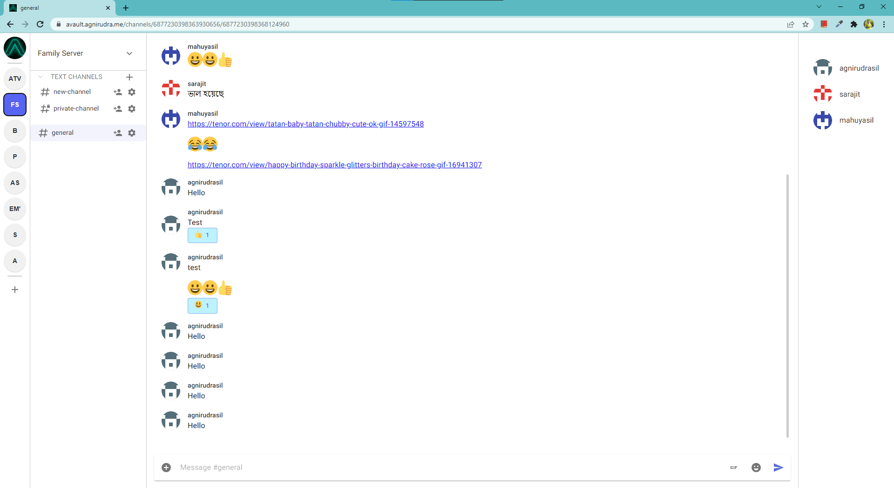

<!-- PROJECT LOGO -->
 

  

<h3 align="center">AVAULT</h3>

  

    Another instant messaging website.
     
    <a href="https://avault.agnirudra.me/api/v1/docs"><strong>Explore the docs »</strong></a>
     

[![Contributors][contributors-shield]][contributors-url]
[![Forks][forks-shield]][forks-url]
[![Stargazers][stars-shield]][stars-url]
[![Issues][issues-shield]][issues-url]
[![MIT License][license-shield]][license-url]
     
    <a href="https://avault.agnirudra.me/channels/@me">View Demo</a>
    ·
    <a href="https://github.com/agnirudrasil/avault/issues">Report Bug</a>
    ·
    <a href="https://github.com/agnirudrasil/avault/issues">Request Feature</a>
  

<!-- TABLE OF CONTENTS -->
  <h1>Table of Contents</h1>
  <ul>
    <li>
      <a href="#about-the-project">About The Project</a>
      <ul>
        <li><a href="#built-with">Built With</a></li>
      </ul>
    </li>
    <li><a href="#features">Features</a></li>
    <li><a href="#roadmap">Roadmap</a></li>
    <li><a href="#contributing">Contributing</a></li>
    <li><a href="#license">License</a></li>
    <li><a href="#feedback">Feedback</a></li>
    <li><a href="#acknowledgments">Acknowledgments</a></li>
  </ul>

<!-- ABOUT THE PROJECT -->
## About The Project

An instant messaging website with messaging and administration features.

### Built With

* [Next.js](https://nextjs.org/)
* [React.js](https://reactjs.org/)
* [FastAPI](https://fastapi.tiangolo.com/)
* [Socket.io](https://scoket.io/)

## Features

- Realtime messaging.
- Previews of links in messages.
- Permissions management through Roles and Channel specific overwrites
- OAuth2 and Bots.
- Message Embeds.
- File Uploads, Emojis and GIFs.

<!-- ROADMAP -->
## Roadmap

- [ ] Voice and video calling.
- [ ] User Friends and DM channels.
- [ ] Channel Threads.
- [ ] User settings and customization.
- [ ] 2-Factor Authentication.
- [ ] Electron Desktop App.
- [ ] Mobile App.

See the [open issues](https://github.com/agnirudrasil/avault/issues) for a full list of proposed features (and known issues).

<!-- CONTRIBUTING -->
## Contributing

Contributions are what make the open source community such an amazing place to learn, inspire, and create. Any contributions you make are **greatly appreciated**.

If you have a suggestion that would make this better, please fork the repo and create a pull request. You can also simply open an issue with the tag "enhancement".
Don't forget to give the project a star! Thanks again!

1. Fork the Project
2. Create your Feature Branch (`git checkout -b feature/AmazingFeature`)
3. Commit your Changes (`git commit -m 'Add some AmazingFeature'`)
4. Push to the Branch (`git push origin feature/AmazingFeature`)
5. Open a Pull Request

<!-- LICENSE -->
## License

Distributed under the MIT License. See `LICENSE.txt` for more information.

<!-- CONTACT -->
## Feedback
Please open a github [issue](LICENSE).

<!-- ACKNOWLEDGMENTS -->
## Acknowledgments

* Logo made by **[Alvin Ben George](https://github.com/alvinbengeorge)**
* [FastAPI Docs](https://fastapi.tiangolo.com)
* [Stackoverflow](https://stackoverflow.com)

  

[contributors-shield]: https://img.shields.io/github/contributors/agnirudrasil/avault
[contributors-url]: https://github.com/agnirudrasil/avault/graphs/contributors
[forks-shield]: https://img.shields.io/github/forks/agnirudrasil/avault
[forks-url]: https://github.com/agnirudrasil/avault/network/members
[stars-shield]: https://img.shields.io/github/stars/agnirudrasil/avault
[stars-url]: https://github.com/agnirudrasil/avault/stargazers
[issues-shield]: https://img.shields.io/github/issues/agnirudrasil/avault
[issues-url]: https://github.com/agnirudrasil/avault/issues
[license-shield]: https://img.shields.io/github/license/agnirudrasil/avault
[license-url]: https://github.com/agnirudrasil/avault/blob/master/LICENSE.txt
[product-screenshot]: images/screenshot.png
